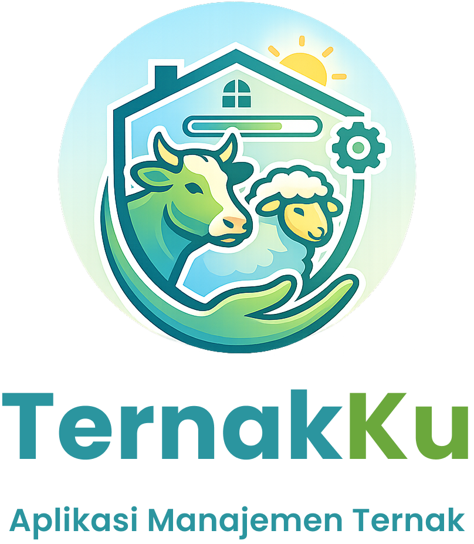
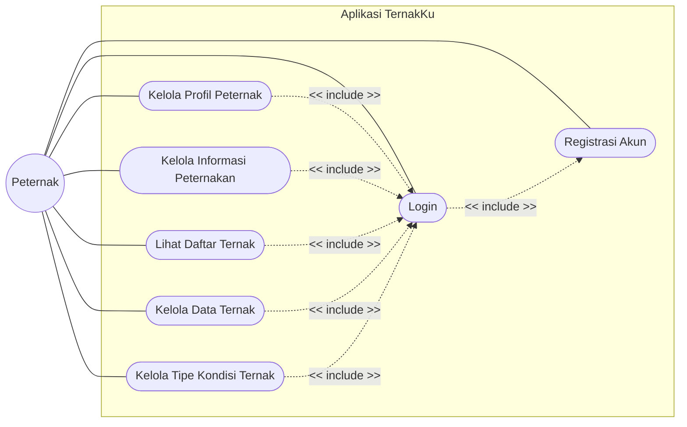
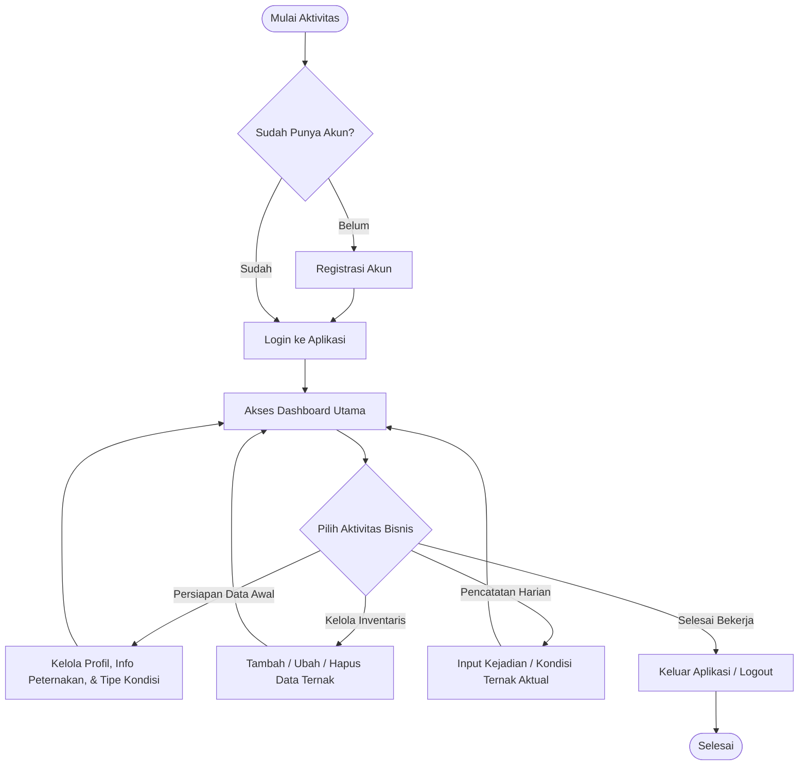

  

---

## 📖 Deskripsi

**TernakKu** adalah aplikasi sistem informasi manajemen berbasis digital yang dirancang untuk membantu peternak dalam mengelola seluruh aktivitas operasional peternakan secara lebih mudah, cepat, dan terstruktur.

Aplikasi ini menggantikan proses pencatatan manual menjadi sistem pencatatan digital yang terintegrasi. Melalui TernakKu, peternak dapat mengelola profil peternakan, mencatat data ternak, serta memantau riwayat kondisi setiap individu ternak secara real-time, mulai dari fase kelahiran, inseminasi buatan, vaksinasi, riwayat penyakit, hingga status penjualan maupun kematian.

Dengan digitalisasi pencatatan tersebut, TernakKu diharapkan mampu meningkatkan efisiensi operasional, menjaga akurasi data, serta membantu meningkatkan produktivitas usaha peternakan.

---

## 🎯 Tujuan Pengembangan

TernakKu dikembangkan untuk membantu peternak dalam:

- Melakukan digitalisasi pencatatan peternakan.
- Mengurangi kesalahan pencatatan manual.
- Mempermudah pemantauan kondisi setiap ternak.
- Menyediakan riwayat ternak yang lengkap dan terdokumentasi.
- Meningkatkan efisiensi pengelolaan usaha peternakan.

## 📌 Use Case

1. **UC1: Registrasi Akun**: Peternak mendaftarkan diri jika belum memiliki akun.

2. **UC2: Login**: Akses masuk ke dalam sistem menggunakan kredensial yang sudah didaftarkan.

3. **UC3: Kelola Profil Peternak**: Memperbarui informasi personal peternak.

4. **UC4: Kelola Informasi Peternakan**: Memperbarui informasi peternakan yang sedang dikelola.

4. **UC5: Lihat Daftar Ternak**: Menampilkan semua ternak yang dimiliki beserta informasi lengkapnya.

5. **UC6: Kelola Data Ternak**: Menambah, mengubah, atau menghapus profil ternak beserta kondisinya.

8. **UC7: Kelola Tipe Kondisi Ternak**: Menambah, mengubah, atau menghapus tipe kondisi ternak (misalnya lahir, vaksin, sakit, atau tipe kustom).

---

## ⚙️ Activity Diagram

1. **Titik Masuk (Autentikasi)**: Peternak memulai dengan mengecek apakah sudah memiliki akun. Jika belum, peternak melakukan registrasi terlebih dahulu, kemudian login ke dalam sistem.

2. **Pusat Kendali (Dashboard)**: Setelah berhasil login, peternak diarahkan ke Dashboard sebagai pusat kendali untuk memilih aktivitas yang akan dilakukan.

3. **Tiga Pilar Aktivitas Bisnis:**
    - **Persiapan Data Awal**: Biasanya dilakukan saat pertama kali menggunakan aplikasi atau jika ada perubahan mendasar (memperbarui nama peternakan atau menambah tipe kondisi baru seperti "Karantina").
    - **Kelola Inventaris Ternak**: Dilakukan ketika ada ternak baru yang masuk ke peternakan (beli/lahir) atau mengubah identitas ternak.
    - **Pencatatan Harian**: Aktivitas yang paling sering dilakukan (rutinitas). Peternak mencatat kondisi ternak secara real-time (misalnya: ternak A divaksin hari ini, ternak B sakit).

4. **Siklus Berulang**: Setelah menyelesaikan satu tugas, peternak kembali ke Dashboard untuk melakukan tugas lain atau memilih keluar (logout) jika pekerjaan selesai.
