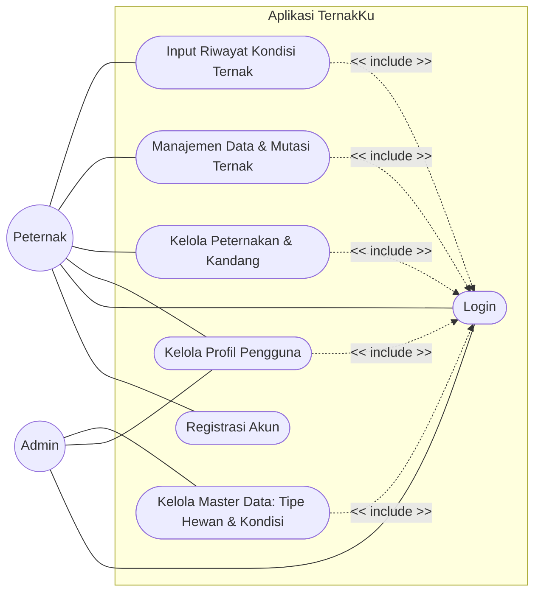
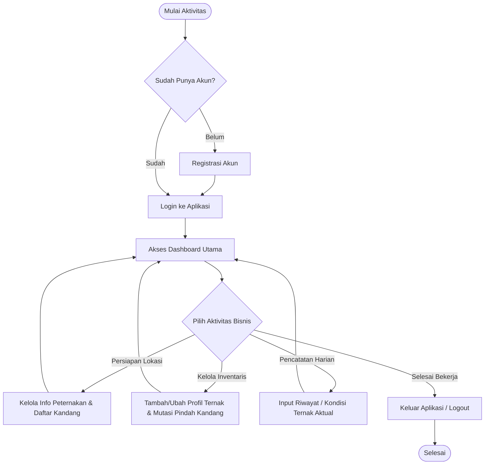

  

---

## 📖 Deskripsi

**TernakKu** adalah aplikasi sistem informasi manajemen berbasis digital yang dirancang untuk membantu peternak dalam mengelola seluruh aktivitas operasional peternakan secara lebih mudah, cepat, dan terstruktur.

Aplikasi ini menggantikan proses pencatatan manual menjadi sistem pencatatan digital yang terintegrasi. Melalui TernakKu, peternak dapat mengelola profil peternakan, memetakan pembagian kandang, mencatat data dan mutasi ternak, serta memantau riwayat kondisi setiap individu ternak secara real-time (mulai dari fase kelahiran, inseminasi buatan, vaksinasi, riwayat penyakit, hingga status penjualan atau kematian).

Dengan digitalisasi pencatatan tersebut, TernakKu diharapkan mampu meningkatkan efisiensi operasional, menjaga akurasi data, serta membantu meningkatkan produktivitas usaha peternakan.

---

## 🎯 Tujuan Pengembangan

TernakKu dikembangkan untuk membantu peternak dalam:

- Melakukan digitalisasi pencatatan operasional peternakan.
- Memetakan manajemen lokasi (kandang) secara akurat.
- Mengurangi kesalahan pencatatan manual dan rekam jejak ternak.
- Mempermudah pemantauan kondisi dan riwayat perpindahan (*transfer*) setiap ternak.
- Meningkatkan efisiensi pengelolaan usaha peternakan secara keseluruhan.

## 📌 Use Case

1. **UC1: Registrasi Akun**: Peternak mendaftarkan diri jika belum memiliki akun.

2. **UC2: Login**: Akses masuk ke dalam sistem menggunakan kredensial yang sudah didaftarkan, berlaku untuk Peternak dan Admin sesuai role masing-masing.

3. **UC3: Kelola Profil Pengguna**: Memperbarui informasi personal pengguna (Peternak/Admin).

4. **UC4: Kelola Peternakan & Kandang**: Peternak memperbarui informasi peternakan yang dikelola serta mengatur daftar kandang beserta kapasitasnya.

4. **UC5: Manajemen Data & Mutasi Ternak**: Peternak melihat daftar ternak, menambah/mengubah data hewan, serta melakukan proses transfer (pindah kandang) antar ternak.

5. **UC6: Input Riwayat Kondisi Ternak**: Peternak mencatat kondisi atau kejadian spesifik pada ternak (misal: lahir, sakit, vaksin) berdasarkan tipe kondisi baku dari sistem.

8. **UC7: Kelola Master Data**: Admin sistem bertugas mengelola (menambah/merubah) parameter baku secara global, seperti jenis hewan (Sapi, Kambing) dan tipe kondisi ternak (Vaksin, Sakit, dll).

---

## ⚙️ Activity Diagram

1. **Titik Masuk (Autentikasi)**: Peternak memulai dengan mengecek apakah sudah memiliki akun. Jika belum, peternak melakukan registrasi terlebih dahulu, kemudian login ke dalam sistem.

2. **Pusat Kendali (Dashboard)**: Setelah berhasil login, peternak diarahkan ke Dashboard sebagai pusat kendali untuk memilih aktivitas yang akan dilakukan.

3. **Tiga Pilar Aktivitas Bisnis:**
    - **Persiapan Lokasi (Kandang)**: Dilakukan saat pertama kali menggunakan aplikasi atau ketika ada penambahan lahan. Peternak mendaftarkan peternakan dan membaginya ke dalam beberapa blok kandang.
    - **Manajemen Inventaris & Mutasi**: Dilakukan ketika ada penambahan ternak baru, pembaruan profil hewan, atau ketika ternak harus dipindahkan dari satu kandang ke kandang lain (mutasi).
    - **Pencatatan Harian**: Aktivitas operasional rutin. Peternak mencatat kondisi ternak secara aktual menggunakan parameter yang sudah disediakan sistem (misalnya: pencatatan vaksinasi atau riwayat sakit).

4. **Siklus Berulang**: Setelah menyelesaikan satu tugas, peternak kembali ke Dashboard untuk melakukan tugas lain atau memilih keluar (logout) jika pekerjaan selesai.

## 🗄️ Entity Relationship Diagram (ERD)

